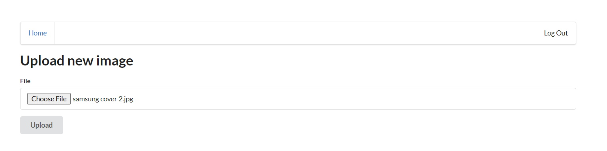
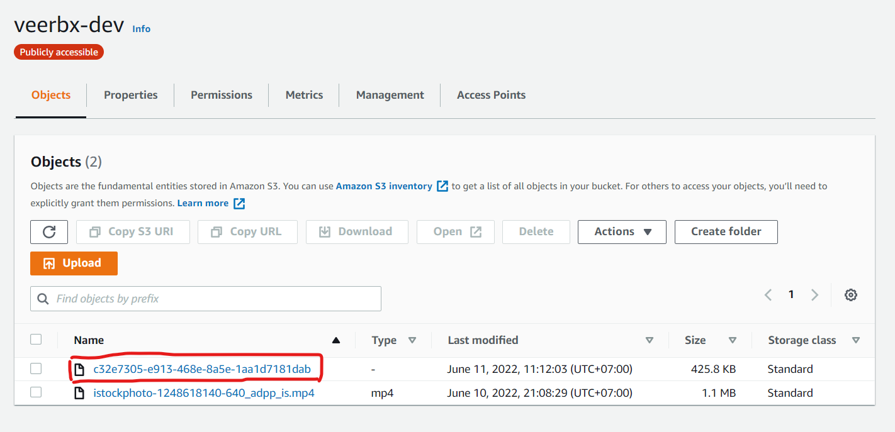
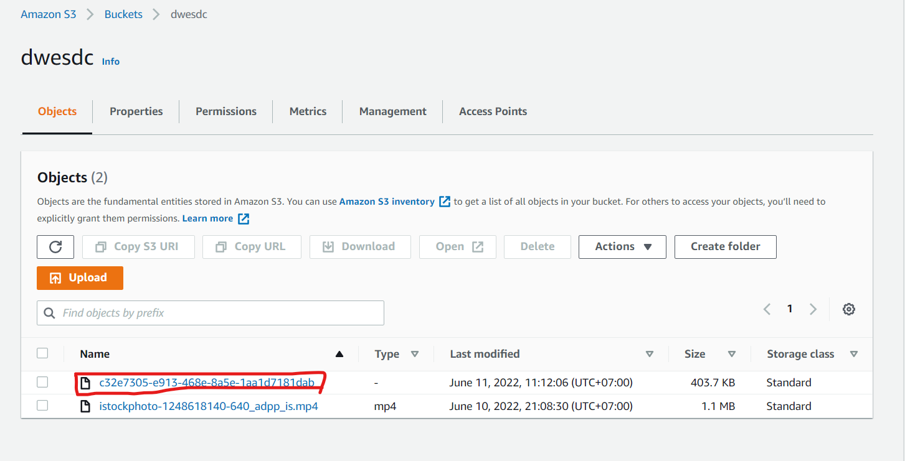
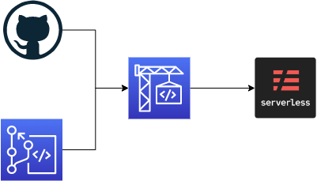
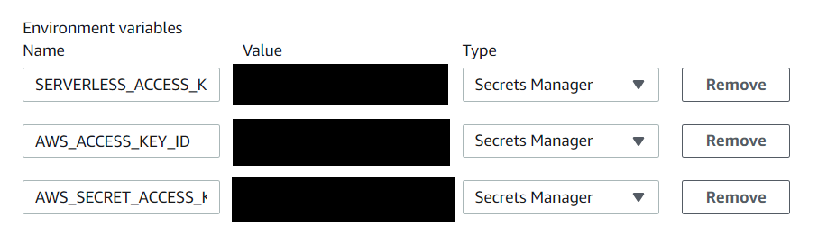

# CapStone Project

New Features:

  - Auto Sync File in Upload bucket to another bucket 
  - Display Video if user upload MP4 file

  Upload File:
    

  Source Bucket:
    

  Destination Bucket:
    

  Display Video:
    

# Containter

  We can contaimetering the backend procress with docker:

    - Create .env file: 
        SLS_KEY=xxxxxxxxxxxxxxxxxxxx
        SLS_SECRET=xxxxxxxxxxxxxxxxxxxxxxxxxxxxxxxxxxxxxxxx
        PROFILE=severless
        SERVERLESS_ACCESS_KEY=xxxxxxxxxxxxxxxxxxxxxxxxxxxxxxxxxxxxxxxxxxxx

    - docker build -t serverlessapp .

# CICD Process

- Commit code to Codecommit/Github
- Create CodeBuild Project
- Set up environment in CodeBuild: 
    
- Result: 

